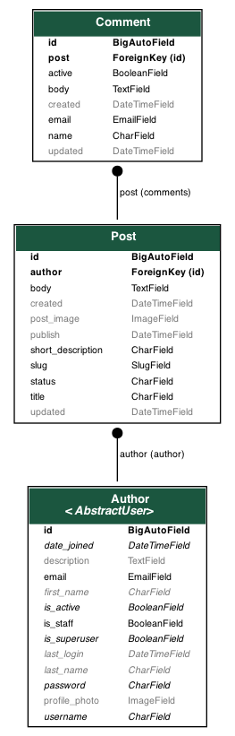

# Simple django blog

### Blog project:

- User auth
- Markdown
- comment system
- email notification via celery

### Данные для заполнения каталога в fixtures.json:
`./manage.py loaddata fixtures.json`

### Структура приложения:
